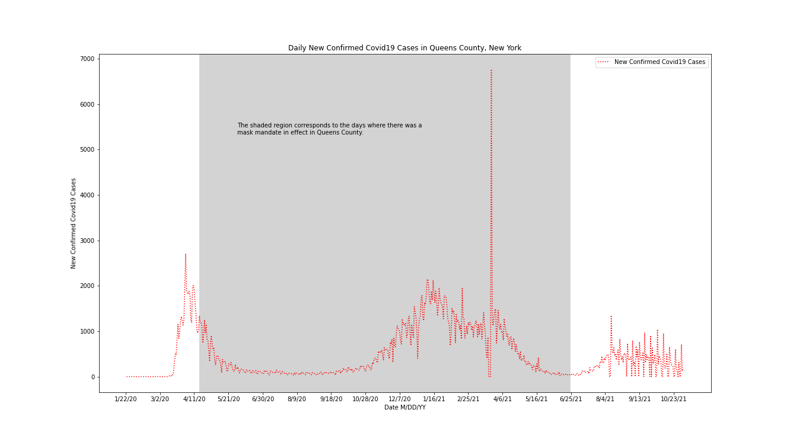

# Visualization Explanation 

Figure.png shows the change in the number of confirmed new covid cases per day in Queens County, New York. Where the line goes above 0 on the y-axis represents days where there were more confirmed new covid cases than the day before. Where the line goes below 0 on the y-axis represents days where there were fewer confirmed new covid cases than the day before. The grey shaded region of the graph shows when there was a mask mandate in effect in the county. The underlying data was calculated by taking the cumulative case count and subtracting a copy of that data that has been shifted ahead one day. This result shows the daily new confirmed cases and is plotted on the y-axis. The x-axis represents the date the given change in cumulative cases represents.
